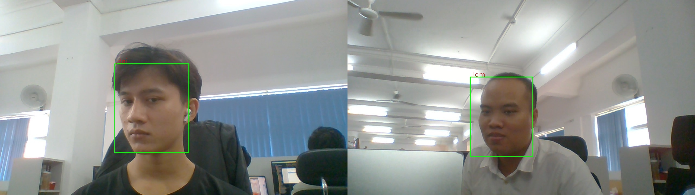

# Face-Recognition_FastAPI_and_GUI-APP
Face recognition is a method of identifying or verifying the identity of an individual using their face. My face recognition systems can be used to identify people in photos, video, or in real-time


[](https://www.youtube.com/channel/UCKvgGs-ALhvOq9u95PHXHNw)
# Setup
Download folder [model](https://drive.google.com/drive/folders/1cFKeD757YEP9H93YhURDiTq4RIwx3mP5?usp=drive_link), unzip and copy to project run directory: model

# Live Demo
```html
https://drive.google.com/file/d/1bmZOOjgkWUyoaE7mVaXY3MwU3VSjGAlq/view?usp=sharing

```


# A very Simple Gui app and fast API for Face Recongition

  - Train User
  - Attendence entry
  - reports
  
# Installation

1 : Install the requirements .

```sh
$ pip install -r  requirements.txt
```

2 : Run The App 

```sh
$ python face_attendend.py
```
2 : Run The API

```sh
$ python fast_api.py
```


# APP GUI

### Home Page


### Add a User <br>
Add the user you want to save datasets <br>
<br>


### Face recognition and record<br>
Capture Data From the face then recognition<br>
<br>

<br>

### Reports<br>
Displays information about identified people<br>
<br>

### Recognition with many people <br>
A webcam window will popup and start recognition proccess<br>


<br><br>
# API Face-Recognition
## Requirements

Python 3.7+

FastAPI stands on the shoulders of giants:

* <a href="https://www.starlette.io/" class="external-link" target="_blank">Starlette</a> for the web parts.
* <a href="https://pydantic-docs.helpmanual.io/" class="external-link" target="_blank">Pydantic</a> for the data parts.
### Run it

Run the server with:

<div class="termy">

```console
$ uvicorn main:app --reload

INFO:     Uvicorn running on http://127.0.0.1:8000/ (Press CTRL+C to quit)
INFO:     Started reloader process [28720]
INFO:     Started server process [28722]
INFO:     Waiting for application startup.
INFO:     Application startup complete.
```
### Interactive API docs

Now go to <a href="http://127.0.0.1:8000/docs" class="external-link" target="_blank">http://127.0.0.1:8000/docs</a>.

You will see the automatic interactive API documentation (provided by <a href="https://github.com/swagger-api/swagger-ui" class="external-link" target="_blank">Swagger UI</a>):

### Alternative API docs

And now, go to <a href="http://127.0.0.1:8000/redoc" class="external-link" target="_blank">http://127.0.0.1:8000/redoc</a>.

You will see the alternative automatic documentation (provided by <a href="https://github.com/Rebilly/ReDoc" class="external-link" target="_blank">ReDoc</a>):
### Check it now 👌

Now go to <a href="http://127.0.0.1:8000/docs" class="external-link" target="_blank">http://127.0.0.1:8000/docs</a>.

* The interactive API documentation will be automatically updated, including the new body:
  


* Click on the button "Try it out", it allows you to upload file and directly interact with the API:


* Then click on the "Execute" button, the user interface will communicate with your API, get the results and show them on the screen:

Image example


Return results




Made By ❤ : [NguyenDai](nguyenvandai_t66@hus.edu.vn)<br>
**Free Software, Hell Yeah!**


